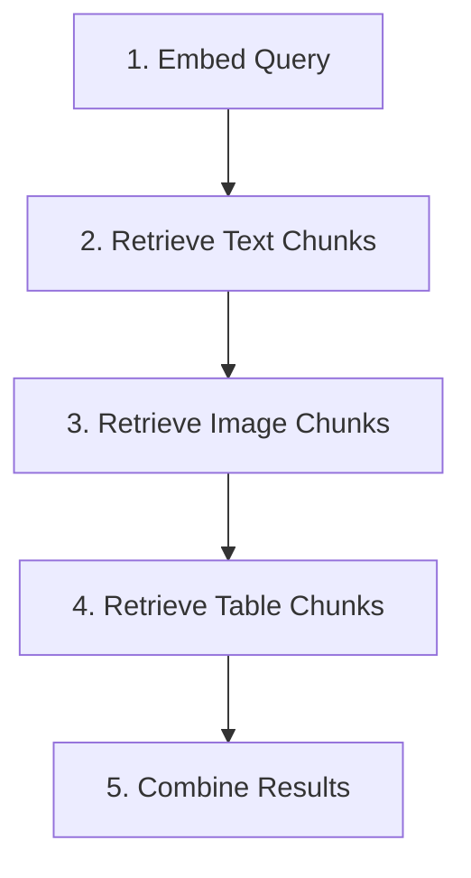

# Retrieval Agent (Agent 3) - Technical Guide

## 📋 Overview

The **Retrieval Agent** is the core search engine of the Multimodal Agentic RAG system. It performs **hybrid retrieval** across three distinct chunk types (text, images, tables) using a combination of **vector similarity search** and **keyword matching** techniques.

**Location**: [`agents/retrieval_agent.py`](agents/retrieval_agent.py)

---

## 🏗️ Architecture

Built with **LangGraph**, the agent implements a 5-step sequential workflow:



### Workflow State

The agent maintains a `RetrievalState` throughout execution:

```python
{
    'query': str,                          # User query
    'query_embedding': List[float],        # 1024-dim embedding
    'text_results': List[Dict],            # Text chunk results
    'image_results': List[Dict],           # Image chunk results
    'table_results': List[Dict],           # Table chunk results
    'all_results': List[Dict],             # Combined results
    'top_k': int,                          # Results per type
    'error': str                           # Error messages
}
```

---

## 🔍 Detailed Workflow Steps

### Step 1: Embed Query 🔤

**Purpose**: Convert the user's natural language query into a vector embedding for similarity search.

**Process**:
1. Takes user query string
2. Calls AWS Bedrock Titan Embeddings v2
3. Generates 1024-dimensional embedding vector
4. Stores in state for subsequent retrieval steps

**Technology**: Amazon Titan Embeddings v2 (`amazon.titan-embed-text-v2:0`)

**Example**:
```
Query: "What are the governance factors for business readiness?"
Output: [0.0234, -0.0521, 0.0891, ..., 0.0345] (1024 dimensions)
```

**Error Handling**: If embedding fails, workflow continues but retrieval will be limited

---

### Step 2: Retrieve Text Chunks 📄

**Purpose**: Find semantically similar text passages using vector similarity.

**Search Method**: **Cosine Similarity** (pgvector extension)

**SQL Query**:
```sql
SELECT 
    chunk_id,
    chunk_type,
    section_id,
    source_document,
    content,
    metadata,
    embedding,
    1 - (embedding <=> %s::vector) as similarity_score
FROM text_chunks
WHERE embedding IS NOT NULL
ORDER BY embedding <=> %s::vector
LIMIT %s;
```

**Key Details**:
- **Operator**: `<=>` (cosine distance operator)
- **Conversion**: Distance converted to similarity: `similarity = 1 - distance`
- **Range**: Similarity scores between 0.0 (dissimilar) and 1.0 (identical)
- **Ordering**: Closest vectors (lowest distance) ranked first

**Output Structure**:
```python
{
    'chunk_id': 'doc1_section2_chunk_5',
    'chunk_type': 'text',
    'section_id': 'chapter_2',
    'source_document': 'Business Ready 2025.pdf',
    'content': 'Governance factors include...',
    'metadata': {'page': 42, 'section_title': 'Governance'},
    'similarity_score': 0.8547,
    'retrieval_method': 'vector_similarity'
}
```

---

### Step 3: Retrieve Image Chunks 🖼️

**Purpose**: Find relevant images by searching their AI-generated summaries.

**Search Method**: **Vector Similarity on Image Summaries**

**Process**:
1. Query embedding compared against image summary embeddings
2. Image summaries were generated by Claude Sonnet (during document parsing)
3. Uses same cosine similarity approach as text chunks

**SQL Query**:
```sql
SELECT 
    chunk_id,
    chunk_type,
    section_id,
    source_document,
    image_type,
    image_summary,
    metadata,
    embedding,
    1 - (embedding <=> %s::vector) as similarity_score
FROM image_chunks
WHERE embedding IS NOT NULL
ORDER BY embedding <=> %s::vector
LIMIT %s;
```

**Why This Works**:
- Image summaries are descriptive text (e.g., "Chart showing GDP growth by region")
- Text embeddings capture semantic meaning
- Relevant images retrieved even without visual embedding models

**Output Structure**:
```python
{
    'chunk_id': 'doc1_image_12',
    'chunk_type': 'image',
    'image_type': 'chart',
    'image_summary': 'Bar chart comparing regulatory efficiency...',
    'content': 'Bar chart comparing regulatory efficiency...',  # Summary as content
    'similarity_score': 0.7893,
    'retrieval_method': 'vector_similarity'
}
```

---

### Step 4: Retrieve Table Chunks 📊

**Purpose**: Find relevant structured data tables using keyword matching.

**Search Method**: **Keyword-Based Search** (PostgreSQL ILIKE)

**Why Keyword vs Vector?**
- Tables stored as SQL CREATE statements
- SQL syntax doesn't embed well semantically
- Keywords from query match table/column names directly
- More precise for structured data retrieval

**Process**:
1. Extract terms from query: `"governance factors"` → `["governance", "factors"]`
2. Search across:
   - Table names
   - SQL CREATE statements
   - Metadata (descriptions, column info)
3. Case-insensitive pattern matching

**SQL Query**:
```sql
SELECT 
    chunk_id,
    chunk_type,
    section_id,
    source_document,
    table_name,
    sql_query,
    metadata
FROM table_chunks
WHERE (LOWER(table_name) ILIKE '%governance%' OR 
       LOWER(sql_query) ILIKE '%governance%' OR 
       LOWER(metadata::text) ILIKE '%governance%')
   OR (LOWER(table_name) ILIKE '%factors%' OR 
       LOWER(sql_query) ILIKE '%factors%' OR 
       LOWER(metadata::text) ILIKE '%factors%')
LIMIT %s;
```

**Relevance Scoring**:
```python
# Count keyword occurrences
relevance_score = 0
searchable_text = f"{table_name} {sql_query} {metadata}".lower()
for term in query_terms:
    relevance_score += searchable_text.count(term)

# Normalize: score = min(1.0, count / (num_terms × 3))
relevance_score = min(1.0, relevance_score / (len(query_terms) * 3))
```

**Output Structure**:
```python
{
    'chunk_id': 'doc1_table_governance_scores',
    'chunk_type': 'table',
    'table_name': 'governance_performance',
    'sql_query': 'CREATE TABLE governance_performance (...)',
    'content': 'Table: governance_performance\nSQL: CREATE TABLE...',
    'similarity_score': 0.6667,  # Based on keyword matches
    'retrieval_method': 'keyword_matching'
}
```

---

### Step 5: Combine Results 🔀

**Purpose**: Merge all retrieved chunks and normalize scores for ranking.

**Process**:
1. Concatenate text + image + table results
2. Sort by similarity score (descending)
3. Calculate statistics (max, min, average scores)
4. Provide type distribution breakdown

**Output Metadata**:
```python
{
    'total_results': 25,
    'text_chunks': 10,
    'image_chunks': 8,
    'table_chunks': 7,
    'score_range': (0.4521, 0.8934),
    'average_score': 0.7123
}
```

**Result Object**:
```python
{
    'query': 'original query string',
    'results': [...],              # All combined chunks
    'text_results': [...],         # Text only
    'image_results': [...],        # Images only
    'table_results': [...],        # Tables only
    'num_results': 25
}
```

---

## 🎯 Scoring & Ranking

### Similarity Scores

| Score Range | Interpretation | Typical Cause |
|-------------|----------------|---------------|
| **0.9 - 1.0** | Highly relevant | Direct semantic match, near-duplicate content |
| **0.7 - 0.9** | Very relevant | Strong topical alignment, answers query |
| **0.5 - 0.7** | Moderately relevant | Related concepts, useful context |
| **0.3 - 0.5** | Weakly relevant | Tangential relation, broad topic match |
| **0.0 - 0.3** | Not relevant | Different topic, retrieved by partial keyword |

### Retrieval Methods

1. **Vector Similarity** (Text, Images):
   - Cosine distance: `distance = 1 - (vec1 · vec2) / (||vec1|| × ||vec2||)`
   - Converted to similarity: `similarity = 1 - distance`
   - Captures semantic meaning and context

2. **Keyword Matching** (Tables):
   - Term frequency scoring
   - Case-insensitive substring matching
   - Better for structured data with specific column/table names

---

## 🔧 Configuration

### Initialization

```python
from agents.retrieval_agent import RetrievalAgent

# Default: retrieve top 10 per chunk type
agent = RetrievalAgent(top_k=10)

# Custom: retrieve top 5 per chunk type
agent = RetrievalAgent(top_k=5)
```

### Database Requirements

**Required Tables**:
1. `text_chunks` - Text passages with embeddings
2. `image_chunks` - Image summaries with embeddings
3. `table_chunks` - SQL table definitions

**Required Extensions**:
- `pgvector` - Vector similarity operators

**Connection**: Uses `DatabaseManager` from `utils.db_utils`

---

## 📊 Performance Considerations

### Query Optimization

**Text & Image Retrieval**:
- **Index**: Create vector index on embedding columns
  ```sql
  CREATE INDEX idx_text_embedding ON text_chunks 
  USING ivfflat (embedding vector_cosine_ops);
  ```
- **Impact**: 10-100x faster searches on large datasets
- **Trade-off**: Slight accuracy loss (configurable)

**Table Retrieval**:
- **Index**: GIN index on table_name and sql_query
  ```sql
  CREATE INDEX idx_table_name_gin ON table_chunks 
  USING gin(table_name gin_trgm_ops);
  ```
- **Impact**: Faster ILIKE pattern matching

### Retrieval Limits

- Default `top_k=10` per chunk type = **30 total chunks max**
- Balanced for quality vs quantity
- Adjust based on downstream processing capacity

### API Costs

- **Embedding Generation**: ~$0.0001 per query (Titan v2)
- **Database Queries**: Negligible (self-hosted PostgreSQL)
- **Total**: Very cost-effective

---

## 🚀 Usage Examples

### Basic Retrieval

```python
from agents.retrieval_agent import RetrievalAgent

# Initialize
agent = RetrievalAgent(top_k=10)

# Retrieve
results = agent.retrieve("What are governance factors for business readiness?")

# Access results
print(f"Found {results['num_results']} total chunks")
for chunk in results['results'][:5]:
    print(f"[{chunk['chunk_type']}] Score: {chunk['similarity_score']:.4f}")
    print(f"Content: {chunk['content'][:100]}...\n")
```

### Type-Specific Retrieval

```python
# Get only text results
text_chunks = results['text_results']

# Get only image results
image_chunks = results['image_results']

# Get only table results
table_chunks = results['table_results']
```

### Custom Top-K

```python
# Retrieve fewer results per type
results = agent.retrieve(
    query="regulatory efficiency metrics",
    top_k=5  # 5 per type = 15 total max
)
```

---

## 🔄 Integration in Pipeline

### Position in System

```
Document Parser (Agent 1) → Document Embedder (Agent 2)
                                    ↓
                              [Database Storage]
                                    ↓
User Query → Retrieval Agent (Agent 3) → Reranking Agent (Agent 4)
                                    ↓
                          Text-to-SQL / Response Generation
```

### Called By

**Main Application** (`main.py`):
```python
# After document processing
retrieval_agent = RetrievalAgent(top_k=10)

# User submits query
results = retrieval_agent.retrieve(user_query)

# Pass to reranking
reranked = reranking_agent.rerank(
    query=user_query,
    retrieved_chunks=results['results']
)
```

### Outputs To

- **Reranking Agent**: Receives all retrieved chunks for rescoring
- **UI/Display**: Shows initial retrieval results
- **Analytics**: Logs retrieval statistics

---

## ⚙️ Advanced Features

### Hybrid Search Strategy

The agent combines **two complementary search paradigms**:

| Aspect | Vector Similarity | Keyword Matching |
|--------|-------------------|------------------|
| **Best For** | Semantic meaning | Exact terms |
| **Handles** | Synonyms, paraphrasing | Specific names, IDs |
| **Used For** | Text, images | Tables |
| **Example** | "car" matches "automobile" | "table_name" matches "TABLE_NAME" |

### Multi-Modal Retrieval

**Unified Interface** across chunk types:
- Each chunk type has standard fields: `chunk_id`, `content`, `similarity_score`
- Downstream agents don't need to handle type-specific logic
- Seamless integration with reranking

### Error Resilience

**Graceful Degradation**:
- If embedding fails → continue with available data
- If one chunk type fails → retrieve others
- All errors logged in state['error']

---

## 🐛 Troubleshooting

### No Results Returned

**Check**:
1. Database has embedded chunks: `SELECT COUNT(*) FROM text_chunks WHERE embedding IS NOT NULL;`
2. Query generates embedding: Look for "Generated X-dimensional query embedding" in logs
3. Similarity threshold: Lower scores might be filtered by downstream agents

### Low Similarity Scores

**Causes**:
- Query very different from document content
- Embeddings not normalized properly
- Need more diverse training data

**Solutions**:
- Rephrase query to match document language
- Check embedding model configuration
- Add query expansion/reformulation step

### Table Retrieval Misses

**Causes**:
- Table/column names don't match query terms
- Metadata incomplete

**Solutions**:
- Add table descriptions to metadata
- Use synonyms in table/column naming
- Consider switching to vector embeddings for tables

---

## 📈 Metrics & Monitoring

### Key Performance Indicators

```python
# After retrieval
results = agent.retrieve(query)

# Log metrics
metrics = {
    'query': query,
    'total_results': results['num_results'],
    'text_count': len(results['text_results']),
    'image_count': len(results['image_results']),
    'table_count': len(results['table_results']),
    'avg_score': np.mean([r['similarity_score'] for r in results['results']]),
    'top_score': max([r['similarity_score'] for r in results['results']]) if results['results'] else 0
}
```

### Success Criteria

- **Coverage**: All 3 chunk types represented in top results
- **Relevance**: Top scores > 0.7
- **Diversity**: Multiple source documents in results
- **Latency**: < 500ms for typical query

---

## 🔮 Future Enhancements

### Potential Improvements

1. **Reciprocal Rank Fusion (RRF)**
   - Combine vector + keyword scores for tables
   - Better hybrid ranking

2. **Query Expansion**
   - Use LLM to generate query variations
   - Retrieve with multiple embeddings, merge results

3. **Contextual Embeddings**
   - Include document metadata in embeddings
   - Section-aware retrieval

4. **Adaptive Top-K**
   - Adjust per chunk type based on score distribution
   - Return fewer low-quality results

5. **Caching**
   - Cache query embeddings
   - Cache common queries

---

## 📚 References

### Technologies Used

- **LangGraph**: Workflow orchestration
- **pgvector**: PostgreSQL vector extension
- **Amazon Bedrock Titan v2**: Text embeddings
- **PostgreSQL**: Database backend

### Related Agents

- [Agent 1: Document Parser](agents/document_parse_agent.py) - Extracts chunks
- [Agent 2: Document Embedder](agents/document_embedder.py) - Creates embeddings
- [Agent 4: Reranking Agent](agents/reranking_agent.py) - Refines results

### Documentation

- [Project Summary](PROJECT_SUMMARY.md)
- [Quick Start Guide](QUICKSTART.md)
- [Database Schema](db_tools.py)

---

## 🎓 Summary

The **Retrieval Agent** is a sophisticated multi-modal search engine that:

✅ **Handles 3 chunk types** (text, images, tables) with specialized strategies  
✅ **Uses vector similarity** for semantic search on text and images  
✅ **Uses keyword matching** for structured table data  
✅ **Combines results** with normalized scoring  
✅ **Integrates seamlessly** with LangGraph workflow  
✅ **Provides explainable** retrieval with multiple signals  

**Key Innovation**: Unified interface for multi-modal retrieval with type-specific optimization strategies.
